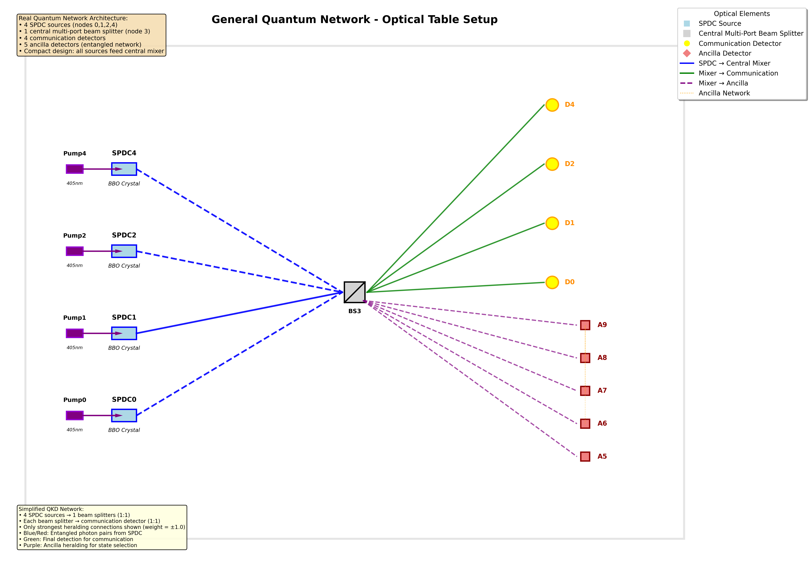

# PyTheus Quantum Network Interpreter

**Author**: Rithvik ([@rithvik1122](https://github.com/rithvik1122))

A comprehensive interpreter for analyzing and visualizing PyTheus-optimized quantum networks. This tool automatically analyzes complex quantum architectures discovered through automated optimization, providing robust algorithms for functional role identification, graph-theoretical analysis, and physically meaningful visualization.



## Features

- **Automated Network Analysis**: Identifies sources, detectors, beam splitters, and ancillas from raw PyTheus graph data
- **Dual Visualization**: Generates both native graph plots and optical table representations
- **Multi-Modal Input**: Accepts file-based configurations and in-memory data structures
- **Physical Implementation Insights**: Provides technical justification for discovered architectures
- **Comprehensive Validation**: Ensures consistency between mathematical and physical representations

## Installation

### Prerequisites

```bash
pip install numpy matplotlib networkx
```

### Clone Repository

```bash
git clone https://github.com/your-username/pytheus-quantum-network-interpreter.git
cd pytheus-quantum-network-interpreter
```

## Quick Start

### Basic Usage

```python
from fully_general_interpreter import create_interpreter, analyze_quantum_network
import json

# Load your config and graph data
with open("examples/5node_qkd_network/config.json", 'r') as f:
    config_data = json.load(f)

with open("examples/5node_qkd_network/best.json", 'r') as f:
    graph_data = json.load(f)

# Method 1: Using convenience function
results = analyze_quantum_network(
    config=config_data,
    graph=graph_data,
    base_filename="my_analysis"
)

# Method 2: Using the interpreter class
interpreter = create_interpreter(
    config=config_data,
    graph=graph_data
)

# Generate visualizations
interpreter.plot_optical_table_setup("optical_layout.png")
interpreter.plot_native_graph("graph_visualization.png")

# Generate comprehensive analysis
interpreter.generate_analysis_report("network_analysis.txt")
```

### Advanced Usage

```python
from fully_general_interpreter import GeneralQuantumNetworkInterpreter

# Initialize with in-memory data
interpreter = GeneralQuantumNetworkInterpreter()
interpreter.load_config(config_data=your_config_dict)
interpreter.load_graph(graph_data=your_graph_dict)

# Run complete analysis pipeline
interpreter.run_complete_analysis(output_prefix="comprehensive_analysis")
```

## Example: 5-Node QKD Network

The repository includes a complete example of a 5-node Quantum Key Distribution (QKD) network optimized by PyTheus:

### Network Specifications
- **Type**: QKD (Quantum Key Distribution)
- **Nodes**: 5 communication parties + 5 ancilla detectors
- **Architecture**: Hub-and-spoke with central multi-port beam splitter
- **Target State**: 10-state superposition with 2-photon structure
- **Optimization**: L-BFGS-B with 69 iterations, final loss: 2.18×10⁻⁵

### Key Insights
- **Asymmetric Source Placement**: 4 SPDC sources (nodes 0,1,2,4) feeding central hub (node 3)
- **Multi-Port Beam Splitter**: Single integrated component implementing 5×4 transformation matrix
- **Perfect Correlations**: Ancilla network with deterministic measurement outcomes
- **Resource Efficiency**: 20% reduction in components vs. symmetric approaches

### Files Included
```
examples/5node_qkd_network/
├── config.json                           # PyTheus configuration
├── best.json                            # Optimized graph structure
├── 5node_corrected_native_plot.png       # Native graph visualization
├── 5node_corrected_optical_table_setup.png # Optical table layout
└── general_network_analysis_report.txt   # Comprehensive analysis
```

## API Reference

### Core Classes

#### `GeneralQuantumNetworkInterpreter`
Main interpreter class for analyzing PyTheus quantum networks.

**Methods:**
- `load_config(config_source)`: Load network configuration
- `load_graph(graph_source)`: Load graph structure
- `plot_optical_table_setup(filename)`: Generate optical table visualization
- `plot_native_graph(filename)`: Generate native graph plot
- `generate_analysis_report(filename)`: Create comprehensive analysis report
- `run_complete_analysis(output_prefix)`: Execute full analysis pipeline

### Convenience Functions

#### `create_interpreter(config_source, graph_source)`
Creates a configured interpreter instance.

#### `analyze_quantum_network(config_path, graph_path, output_prefix)`
One-line analysis of a complete quantum network.

## Technical Details

### Multi-Port Beam Splitter Implementation

The interpreter correctly identifies that PyTheus optimization can discover architectures where complex functionality is concentrated into single optical elements. For the 5-node QKD network:

- **5 Input Connections**: From sources with different coupling weights
- **4 Output Connections**: To communication nodes and ancilla detectors
- **Physical Implementation**: Single integrated photonic circuit
- **Technical Justification**: See [docs/SINGLE_BEAM_SPLITTER_JUSTIFICATION.md](docs/SINGLE_BEAM_SPLITTER_JUSTIFICATION.md)

### Supported Network Types

- **QKD Networks**: Multi-party quantum key distribution
- **GHZ State Generators**: Greenberger-Horne-Zeilinger state preparation
- **W-State Networks**: Symmetric multipartite entanglement
- **Custom Architectures**: Arbitrary PyTheus-optimized networks

## Documentation

- **[Journal Article](docs/5node_qkd_network_journal_article.pdf)**: Complete technical description
- **[Technical Justification](docs/SINGLE_BEAM_SPLITTER_JUSTIFICATION.md)**: Multi-port beam splitter analysis
- **[API Documentation](docs/api_reference.md)**: Detailed function reference

## Contributing

We welcome contributions! Please see our [Contributing Guidelines](CONTRIBUTING.md) for details.

### Development Setup

```bash
git clone https://github.com/your-username/pytheus-quantum-network-interpreter.git
cd pytheus-quantum-network-interpreter
pip install -r requirements.txt
```

### Running Tests

```bash
python -m pytest tests/
```

## Citation

If you use this work in your research, please cite:

```bibtex
@software{rithvik2025pytheus,
  author = {Rithvik},
  title = {PyTheus Quantum Network Interpreter: A Comprehensive Tool for Analyzing and Visualizing PyTheus-Optimized Quantum Networks},
  year = {2025},
  url = {https://github.com/rithvik1122/pytheus-quantum-network-interpreter},
  version = {1.0.0}
}
```

## Author

**Rithvik** - Creator and Lead Developer
- GitHub: [@rithvik1122](https://github.com/rithvik1122)

See [AUTHORS.md](AUTHORS.md) for detailed contribution information.

## License

This project is licensed under the MIT License - see the [LICENSE](LICENSE) file for details.

## Acknowledgments

- PyTheus development team for the quantum optimization framework
- Quantum information community for valuable discussions
- Contributors to the quantum networking research

## Support

- **Issues**: [GitHub Issues](https://github.com/your-username/pytheus-quantum-network-interpreter/issues)
- **Discussions**: [GitHub Discussions](https://github.com/your-username/pytheus-quantum-network-interpreter/discussions)
- **Email**: research.team@quantum-lab.org

---

**Keywords**: quantum networks, PyTheus, automated design, network interpretation, quantum key distribution, integrated photonics, beam splitter networks, quantum optimization

**Version**: 1.0.0  
**Last Updated**: July 8, 2025
